# **Emma Bindi Portfolio Website - T1A3**

## **Links** 

Website: https://emma-bindi-portfolio.netlify.com/  
 
Github: https://github.com/emmabindi/portfolio  

---

# Purpose

The purpose of the portfolio website is to demonstrate my ability to plan, design, develop and deploy a website from beginning to end.

This portfolio showcases my skills with HTML and CSS languages and ability to write semantic code. It also displays my proficiency with source control through the use of Git as well as proving my capability to consider accessibility and mobile responsiveness requirements and develop the website accordingly. 

The portfolio website is a presentation of me as a developer and introduces prospective employers or teams to who I am, as an IT professional as well as an individual. 

--- 

# **Functionality** 

### **Responsiveness**  

Throughout my planning, I considered the requirement for viewing on mobile devices when designing my portfolio website. 

CSS Flex Box was utilised as frequently as possible which allows the elements of the website to display in a different manner according to screen size. For example, Interests page displays the 'interests cards' two per row for wide screen browsers such as a desktop computer however Flex Box automatically adjusts to one per row if the screen size is under 600px.

Media queries were included in the css styling to create a responsive website. For example, the nav bar re-alignment and text size reductions. 

I tested the responsiveness for every page using different mobile device sizes within Developer Tools in Chrome.

During the design phase, I made the assumption that my target audience of the website would be accessing via a desktop/laptop browser with wide screen as they would likely be IT professionals / recruitment representatives in a workplace setting (not on mobile devices). Therefore, the site was not developed with a 'mobile first' methodology.

**Example of my Flex Grid responsive design for blog post components:*

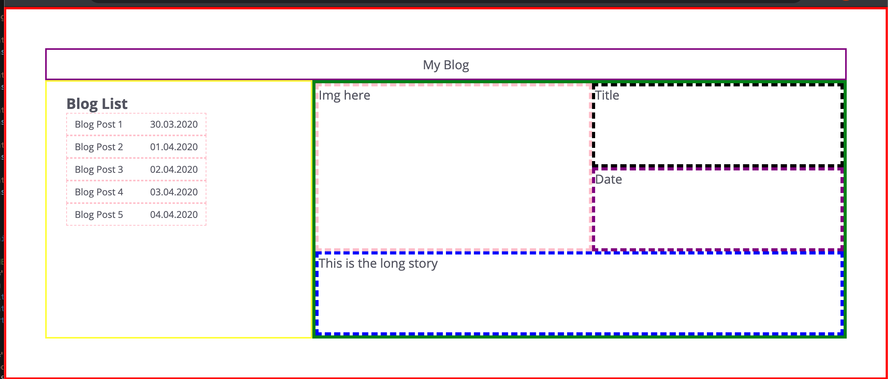

*See 'Screenshots' section below for variations in layout of the website based on Flex Box and media queries.*

### **Accessibility**

While developing my website, I kept in mind that some users would be using screen readers or other technology to access my portfolio. 

With that in mind, I set out to achieve accessibility in my site through use of semantic HTML along with specific titles and clear tags for all elements wherever possible. 

For example, I included an additional element "title" for each page link which allows screen readers to understand what that link is navigating to. 

I used the accessibility audit tools within Chrome to test and review the accessibility. This highlighted any areas of improvement that I was able to adjust and also inspired me to create a new branch of my site in black and white color theme which enhances the color contrast of images.

*See below images of accessibility audit screenshots while completing my testing and updates:*

### **Consistency** 

The website styling and layout is consistent and this has been achieved through use of classes and ID tags in html to allow styling to be carried out across all alike elements. For example, the same font is utilised for headings and paragraph text through the site. 

I have also utilised components in my html to present information in a uniform manner and adhere to a common theme. For example, the footer banner is identical on each webpage.  

### **Semantic HTML**  

HTML elements were named to ensure the code was easy to understand and review. For example, tags such as footer, p and nav were used which provide meaning to that section of html code. 

Additionally, I included extensive comments to highlight and explain various components and styling of code. For example, a description above the *".footer-logos
a:hover"* styling code block to explain that the below code is carried out conditionally upon mouse hover over the footer logo.

### **Sub-Resource Integrity**

Sub-Resource integrity ensures the files delivered to your web browser don't have  unexpected content such as malicious code inserted by a third party.

I implemented sub-resource integrity by creating a hash for styles.css using SHA384 which is linked to my index.html sheet.
This ensures that styles.css will only load if it is identical to it's state when the SHA384 hash was created. If any changes have been made, the stylesheet will not be loaded and the HTML page will be displayed without CSS styling.

--- 

# **Features** 

## **Components List**

Component | Details
--- | --- | ---
**Footer** | Displays at the bottom of each page in an identical manner and includes links to professional accounts. An opacity adjustment upon hover provides feedback to the user that the feature will interact (click through to link)
**Nav Bar** | The title of each page in the site displays within the navigation bar using buttons to inform visitors about the other pages within the website they can access. An color adjustment upon hover provides feedback to the user that the button will interact (click through to link) so they can navigate to another page.
**Header** | The header is placed at the top of the page and contains a hero image, website title and nav bar as this is where users typically navigate to to find this information. The page title displays within the header to inform users of their location within the site and hints to the content of that page. 
**Contact Me Form** | The input fields contain labels to capture data from a visitor such as name/email and the form also includes a submit button. This button uses css styling effects to change upon hover, which informs the user that the feature will interact (submit).
**GitHub Link** | A link is provided within my projects cards for Ruby & HTML/CSS to allow users to view my Github profile. The link displays in a contrasting font color to provide feedback and navigation to the user that this feature will interact. 
**Blog Post Card** | A component was used for creation of each unique blog post entry. It allows uniform and consistent layout through use of CSS Grid and class tags in html. 
**Blog Post List Nav Menu** | A navigation menu appears on the left hand side of the blog posts page to inform the visitor of other blog posts available to view and allows them a way to easily access a different blog post. I used css styling to ensure the navigation bar remained within the users scroll view so no matter where they are on the page they can navigate without having to scroll back up to the top. An color adjustment upon hover provides feedback to the user that the button will interact (click through to link) so they can navigate to another blog post.
**Interests Card** | A component was used for creation of each unique interests card. It allows uniform and consistent layout through use of CSS Flex Box and class tags in html. 
**Portfolio Card** | A component was used for creation of each unique portfolio card. It allows uniform and consistent layout through use of CSS Flex Box and class tags in html. 

---

# **Sitemap**

My portfolio website links all pages to each other using the navigation bar. 
The 'Home' page is the landing page 

*A sitemap for the website is below:* 

**Overview:**

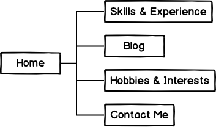

**Detailed:**

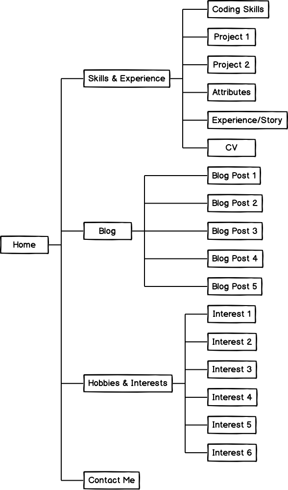

---

# Design 

## **Mood Board**

Before commencing the development of my portfolio website, I spent time creating a mood board to capture my inspiration and theme that I wanted to achieve. 
This included images and color pallettes which appealed to me and that I found cohesive. 
The theme I had in my mind for my portfolio included ideas, values and feelings such as: 

- `Vibrant` 
- `Fresh`
- `Energetic`
- `Simple`
- `Down to Earth` 
- `Friendly & Approachable`
- `Feminine`

I chose these themes, and colors or images which matched these as I believe they translate who I am as an individual. 

It was important for me to include a feminine touch and not shy away from softer features or colors including pink, as I strongly believe and hope that women in tech can feel at home being themselves and displaying an alternative appearance to the very prevalent edgy / masculine / cutting edge / futuristic themes we frequently see in web design. 

## **Wireframes & Mockups**

Prior to commencing the coding and development of my website, I spent a lot of time considering the desired layout for each page including location of navigation bars, hero text and images. I used Balsamiq Wireframes application to carry this out. 

*See below Wireframes displaying my planning:*

**Home**
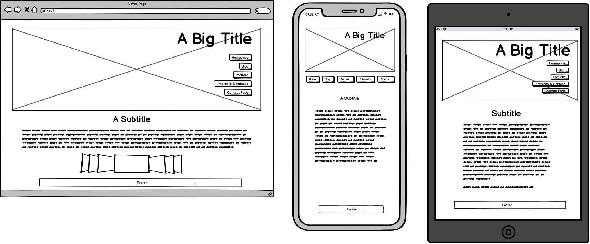

**Blog**
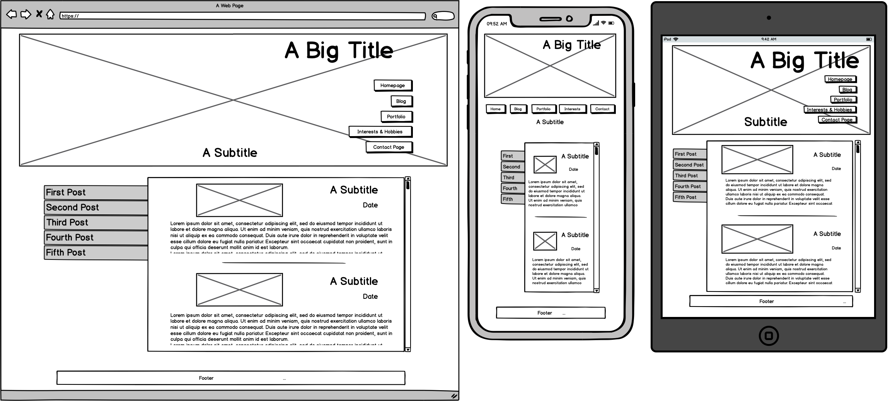

**Hobbies & Interests**
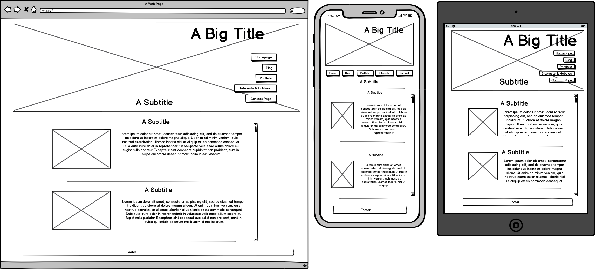

**Portfolio & Skills**
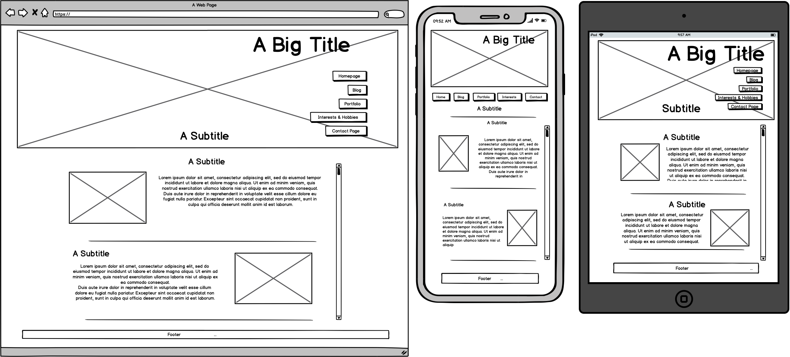

**Contact Me**
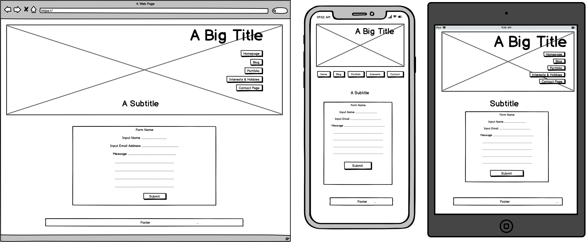

## **Git Branching**

I created different versions of the website which are saved in different git branches and display different visual elements:

- **master**: the original version
- **sofreshnclean**: with transparent header image to create stronger contrast in colours. Also removes the colour background on interests/portfolio pages and cards. This is my favourite theme as it appears very fresh and clean. 
- **bnw**: with black and white only color theme
- **cursivefonts**: with script style fonts 

**So Fresh N Clean**
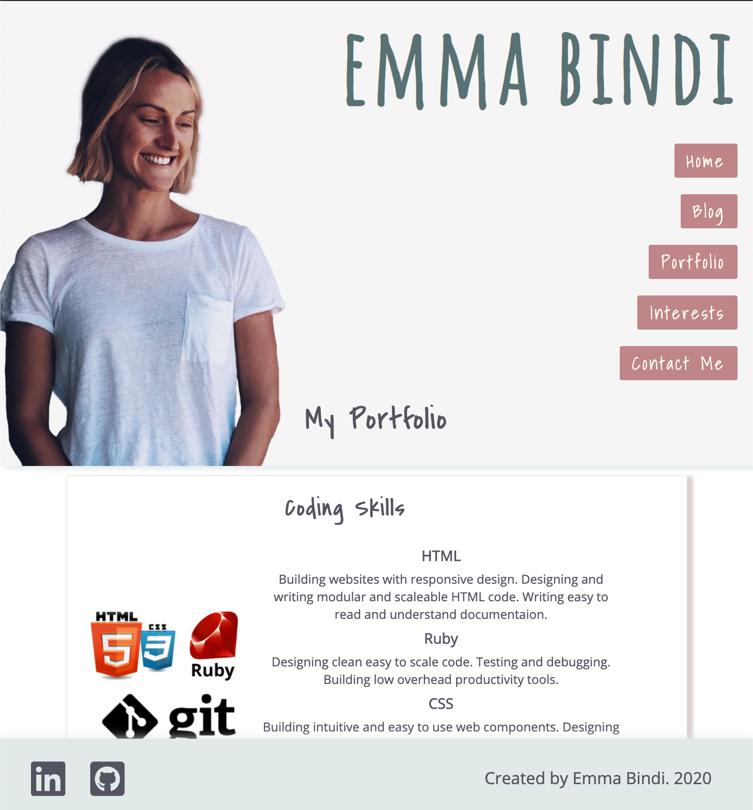

**Black N White**
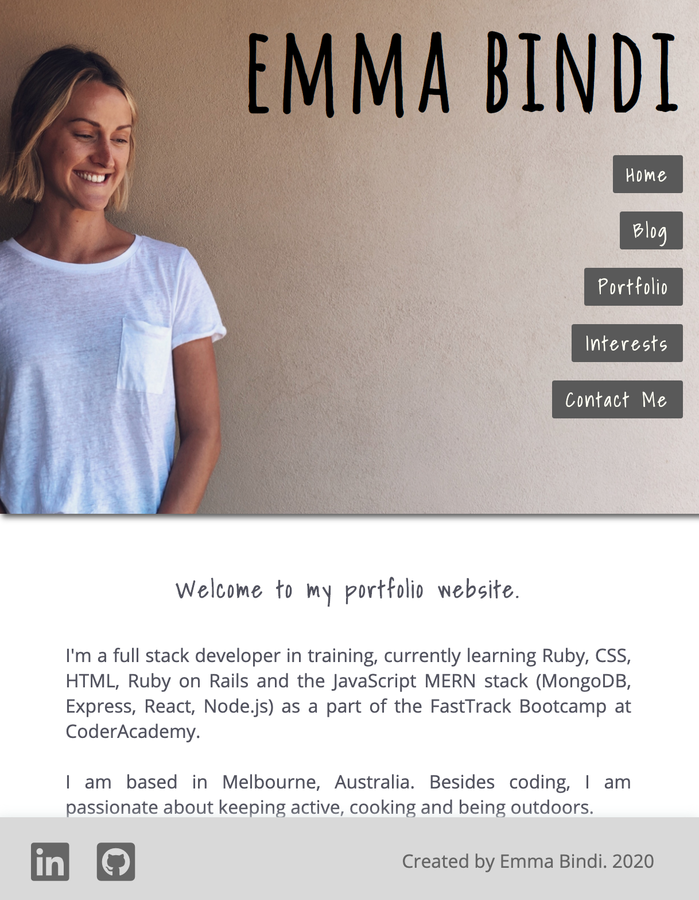

**Cursive Fonts**

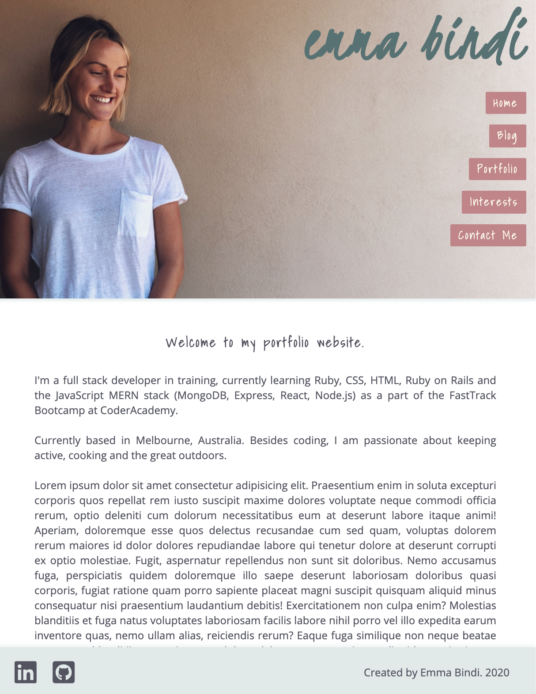

---

## **Screenshots**

*Please see below screenshots of each page in Chrome browser and on an iPhone 6/7/8:* 

**Home**

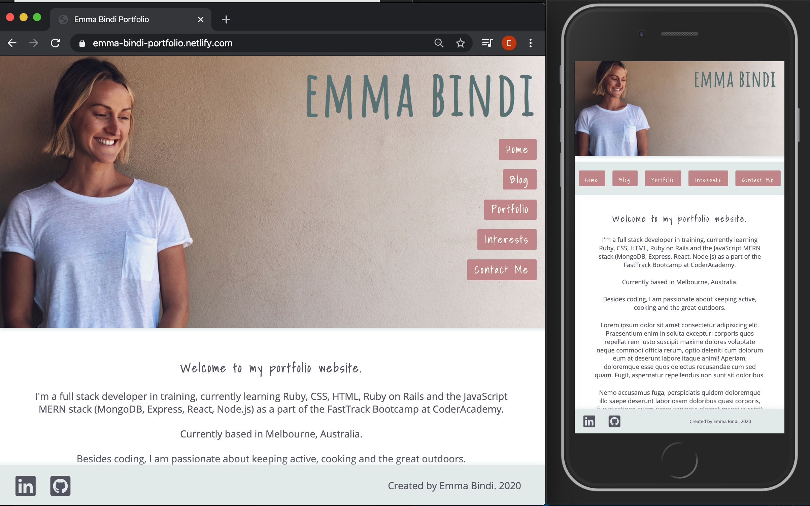

**Blog** 

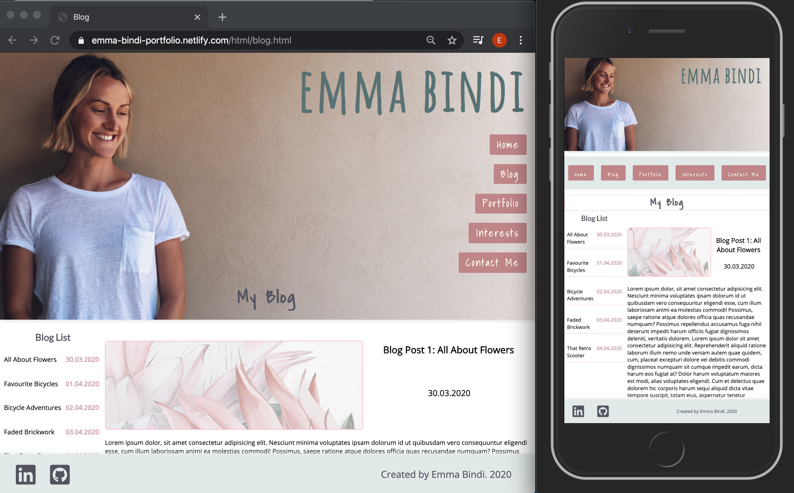

**Portfolio**

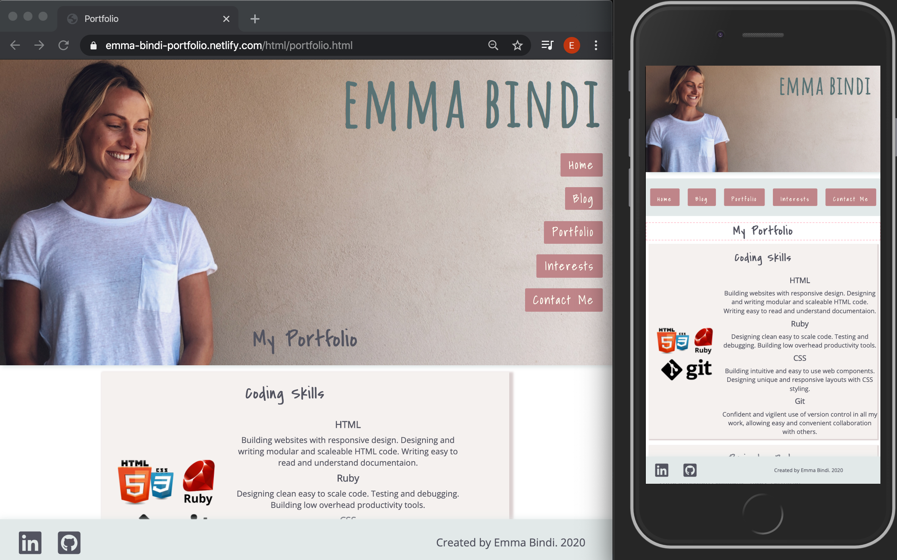

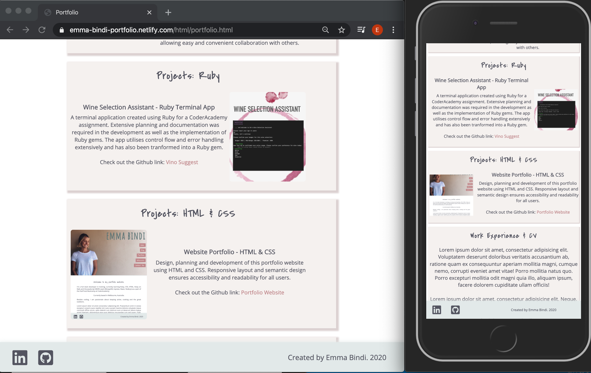

**Interests**

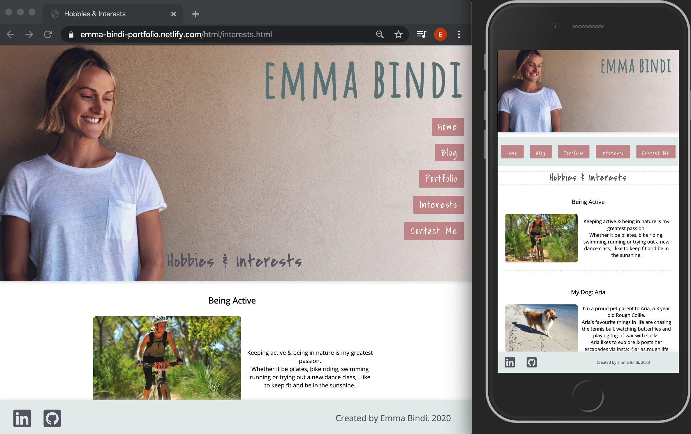

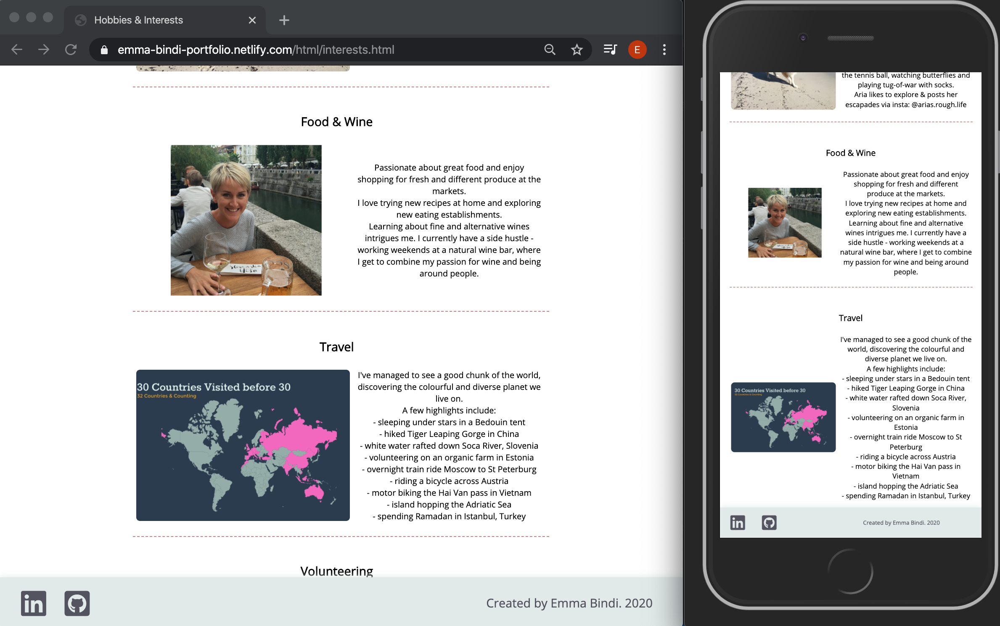

**Contact Me**

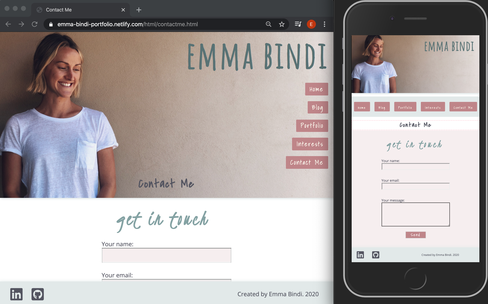
---

# **Target Audience**

The target audience for this portfolio website is prospective employers whom I am hoping to engage with while/upon completing the bootcamp course to obtain employment as a full stack web developer.

This target audience is IT professionals or recruitment representatives from technical companies therefore the assumption is made that the audience has a technical knowledge of programming languages, software development along with high expectations around planning and documentation and an appreciation of creativity and individualism.

---

## **Project Management** 

Task management and tracking was performed using Trello boards. 

*See below screenshot representing a point in time during the development of the portfolio:*

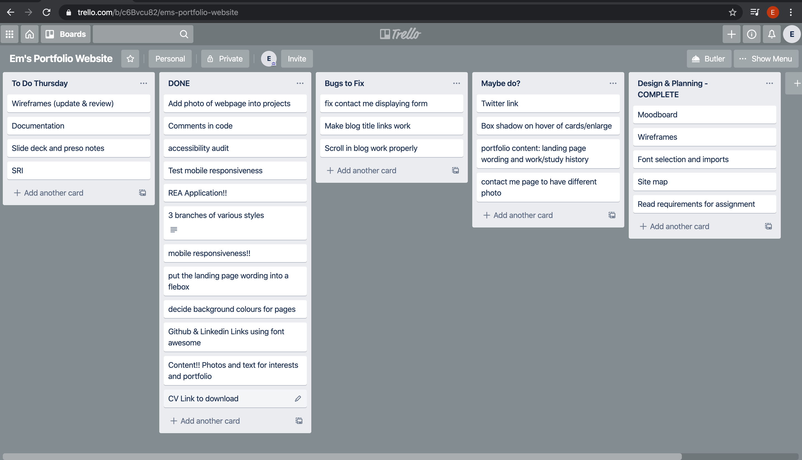

---

# **Tech Stack**  

**HTML** was used for the content of all web pages and components.  

**CSS** was used for the styling and positioning of elements such as text and graphics as well as to handle actions such as efects upon mouse hover over an element.

**Formspree** was utilised for the 'Contact Me' form to capture user input (name, email and message) and automatically email the submission to my email account. 

**Netlify** was the web-hosting platform used to deploy the website. 

**Github** was the git repository hosting service used to share and store my git repository online. 

---
End 
---   